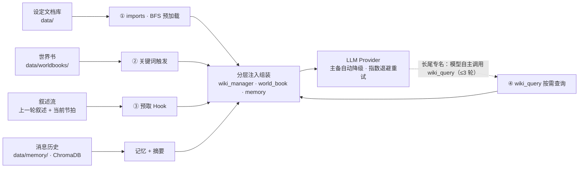

# 知识注入：按确定性分通道召回

> 本文件原为 `rag-retrieval.html`（手写讲解图，已归档到 `archive/`）。这里给出等价的文字版并补上节点级作用域这一后加机制；原「依赖自动构建」机制已于 2026-09 随世界书工作台重构移除，见下。
>
> 状态：随代码演进；实现位置见 `docs/architecture.md`。

## 核心决策

世界观知识是**异构**的：不同确定性的知识走不同的召回通道，而不是一律上向量检索。

**为什么不一律向量检索？**

- **全量注入**：所有设定塞进上下文，大型世界观下 token 撑不住。
- **纯向量 RAG**：按语义相似度召回不可控——角色在 A 章节的事迹可能在讲 B 章节时被提前召回，等于剧透。

因此本项目把「确定性」当成第一排序键：越确定的知识越早、越完整地注入；越依赖语义猜测的知识越靠后、越晚召回。

## 四条召回通道

通道 ① → ④ 的能力是**召回确定性递减 · 按需程度递增**：高频可预测的走预取，长尾走按需查询。

### ① 声明式依赖预加载

- 角色卡 frontmatter 用 `imports` 声明依赖（思路来自 Python `import`）。
- 会话启动沿依赖链 BFS：入口全文 → 直接依赖的关键章节 → 二度依赖一句话摘要。
- **必然需要的知识**走确定性注入，用深度衰减控制成本。
- 世界书侧的对应能力：条目用 `requires`（参与闭包遍历）与 `related`（只作浏览）声明关系，起点用 `activation` × `expansion` 描述；详见 `docs/design/worldbook/worldbook-on-demand.md`。

### ② 关键词触发式世界书

- 兼容 SillyTavern Lorebook，四种来源解析（v1/v2、卡内嵌、jsonl），无损导出回灌。
- 主/副关键词正则触发——事迹只在作者指定的触发词出现时注入。
- **作者完全可控的召回**，从根上杜绝语义漂移与剧情剧透。

### ③ 毫秒级预取 Hook

- 每轮叙述前做纯字符串匹配：扫描上一轮叙述与当前节拍中出现的实体名。
- 大概率会提到的文档按 `core` 深度提前载入。
- **0 次 LLM 调用**，与 Function Calling 互补。实现见 `src/hooks/wiki_prefetch.py`。

### ④ `wiki_query` · Function Calling 按需查询

- 「名称 + 一句话摘要」的轻量目录常驻 system prompt，给模型一本图书馆索引。
- 打分匹配；命中多候选时返回列表让模型二次收敛，不灌模糊全文。
- 工具循环 ≤3 轮，查询结果会话内缓存，长尾知识按需查。

### 记忆系统（与上面四条并列的长期层）

- **角色级**：滑动窗口保最近 10 轮 + ChromaDB 语义检索远期；embedding 不可用时降级为纯窗口。
- **会话级**：每 N 轮由 LLM 把新剧情压缩成 ≤300 字章节摘要；原始历史保留，支持换间隔重算。
- 双层级、降级不硬失败。实现见 `src/memory.py`。

## 分层注入与生成

**组装规则**

- **稳定层**：常驻条目，会话内字节不变。
- **动态层**：触发型条目，一律进动态层以避免打穿前缀缓存。
- 深度衰减：全文 → 关键章节 → 摘要。
- 常驻 `position-0` 条目 → 稳定层；触发型条目 → 动态层（前缀缓存友好，稳定层命中缓存折扣）。

**节点级窄化（后加机制）**：注入时的候选集不是「整本会话白名单」，而是
`会话范围 ∩ 当前节点作用域`。绑定面是世界书里一条**永不注入**的 `lore_bindings` 条目，
作用域在剧情树节点落盘时冻结、随回档一起走，注入路径上零解析。
书内无绑定条目 / 自由模式 / 老会话一律关闭，行为与旧版一致。详见 `docs/design/worldbook/node-scoped-worldbook-loading.md`。

**依赖自动构建（已移除）**：世界书起点与依赖的原「AI 自动构建」链路（元数据索引 → 分段 → 明确引用候选对 → 分析卡 → 判定 → 程序校验）已于 2026-09 随世界书工作台重构删除，两篇专项设计归档到 `docs/archive/worldbook-builder-performance.md`、`docs/archive/worldbook-selective-reading.md`。依赖关系不再由模型构建、改由人手工维护（**依赖功能本身保留**）——但旧工作台 `分类与载入` 页签已撤销、`节点视图` 页签已随 2026-09 信息架构合并整页删除，依赖配置的编辑 UI 当前未挂载（详见 `docs/design/worldbook/worldbook-on-demand.md` 的 2026-09 变更说明）。AI 自动构建的删除范围见 `docs/proposals/worldbook-workbench-redesign.md` §2.4。

## 效果基准

原讲解图给出的同知识集合对照为：全量注入 ≈ 39.8k tokens → 分层方案 ≈ 10.2k tokens（−74.4%）。

> ⚠️ 该数字**在仓库内没有可复现的基准脚本**，属历史估算，不作为当前承诺。
> 原文提到的世界书侧基准脚本（`scripts/benchmark_worldbook_builder.py`、`scripts/benchmark_worldbook_selective_reading.py`）已随 AI 自动构建一并删除，
> 其口径与实测改见归档件 `docs/archive/worldbook-builder-performance.md` §5。
