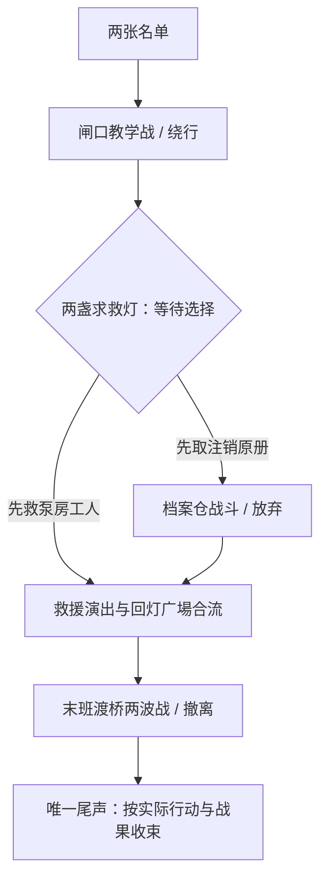

# 《灰灯渡口》交付与体验记录

日期：2026-09-26。范围：新增卡牌网格战术剧情书；保留既有测试剧情和横版模式。分发文件 `data/worldbooks/packs/grey-lantern.json`，正文源 `data/worldbooks/content/plots/grey_lantern/index.md`。

## 开始游玩

更新代码并重启后端后，新建剧情会话，选《灰灯渡口》，绑定同名世界书，战斗模式选卡牌战术（`tactical`）。建议主控博士，队友阿米娅、临光、闪灵；砾可替换队友。旧会话的大纲是冻结副本，更新包不会把旧会话变成新流程；请新建。

这不是对官方剧情的复述，而是泰拉背景独立同人任务。世界书含剧情、行动背景、五名可选角色、四名敌人、一份参考大纲和三份停用的战斗规格参考，共 15 条。剧情及背景默认静态载入；大纲为系统条目；战斗 JSON 参考条目停用且不作为依赖起点，避免原始规格进入叙事。

重新构建只运行 `python scripts/generate_grey_lantern.py`，不会改写其它已发行书。完整生成器也已登记本书；战斗文件及敌人 Markdown 与世界书随仓库一起分发。

## 玩法与分支



- 救人线保住在场工人、可能失去原册；取证线争取完整签章证据，同时留下需要兑现的回接承诺。两条路都有价值，均不要求关键道具才能继续。
- 救人线最多两场战斗，取证线最多三场；每场可战前绕行、战中撤退。失败不要求重打，不拿失败抹掉此前已经救下的人。
- 尾声只有一个节拍：完整证据与主桥胜利呈现“灯照原名”；优先救人或证据不完整但主桥成功呈现“人先靠岸”；末战败退或绕行呈现“余灯未灭”。这是模型依据日志执行的内容约束，不是引擎里的三档数值评分。
- 分叉需点选明确路线；自由提问不会默认为取证。合流场景设最少三轮，留出救援、核对名单和回应苏禾的时间。结局以后仅允许安置和交接余韵。

## 已修复的项目问题

| 问题与复现 | 影响 | 本次处理与验证 |
|---|---|---|
| 模型在 fork 返回 `beat_complete=true`；代码先推进，再合并当前章作者选项 | 未选择就进入仓库，玩家看不到二选一 | 大纲显式 `choice_required`；普通/超时推进都等待有效作者落点。模型第三个目标不能跳过作者路线；定向测试含超时、重载、无效落点 |
| 模型复述作者选项但漏掉 `target_beat_id` | 按标题去重后丢失确定性跳转 | 同名作者落点覆盖模型缺失/错误落点；API 测试验证救援与取证 |
| 树节点只保存选项标题，不保存落点 | 回档后改选取证仍停在分叉 | 保存 `target_beat_id`；真实 rollback-node 接口回归覆盖回档后切另一条路 |
| 固定战斗已声明，却继续调用现场生成；且先推进节拍 | 可能将新战斗绑定到分叉或尾声 | 固定节点存在时不再现场生成；固定触发也视为完成该战斗节拍。新战斗节拍 `min_rounds=1`；对 `combat_scene` 与完成标记组合加防回归测试 |
| 模拟器忽略 `enemies_def` | 内联敌人空场产生假 100% 胜率、1 回合、0 AP | 模拟器读取内联定义并应用局部 stats；断言真实敌人数、血量、第二波及非空战斗 |
| 生成器把已不在分发包内的旧 `plot_graph_near-light` 当必需输入 | 新书构建被无关旧画布阻塞 | 旧画布标为可选；存在时保留，缺失时不虚造。普通必需内容缺失仍失败 |
| 新战斗未登记旧开局基线、枚举仍固定 16 节点 | 全量回归失败，容易误认为内容正常 | 新增三节点开局快照及书归属断言，保留旧快照；按既有最大回合与 XP 单调规范调整内容 |

## 验证口径

战斗使用真实引擎、标准队和低配队两种通用原型，三个节点各 30 固定种子，共 180 场。胜率、中位回合、血损、敌动作与移动 AP 见 `docs/verification/grey-lantern-battles.json`。这是原型队的自动策略验证，不等于推荐角色阵容的人类游玩胜率。部分组 100% 胜率是低难度剧情取向，均有真实敌动作与移动，不是空场假胜。

`tests/test_grey_lantern_flow.py` 使用真实 Flask、真实预装包、会话创建、分支选择、开战与结算接口；仅将 LLM 文本/标记和战斗胜者脚本化。覆盖双路线、胜/败/逃跑、回档改选、重载、唯一结尾和固定战斗不会额外生成。不能把它表述为真实模型或真实战斗策略通关。

真实模型验收使用用户现有模型配置，仅在 worktree 内创建隔离会话和安装副本；不改变用户配置或存档。第二次试走共 13 轮，选择救援路线、闸口和末桥均调用真实战前绕行 API。最后模型明确输出“灰灯渡口的撤离任务到此结束”，并回收纸船、证词与人员去向。逐轮 HTTP 状态、前后节拍、动作、原始回复和绕行结果保存在 `docs/verification/grey-lantern-live.json`。该记录的 `kind` 明确不是实战游玩；没有声称取证路线、全胜结局或所有模型均已实模验收。

第一次试走发现合流一轮过快，增加三轮后重试完成；第二次试走期间后续路由白名单和自由输入说明仍有收紧，最终确定性测试覆盖这些修改。真实模型证据不能当成最终所有代码路径的全量实模回归。

最终回归命令与结果：

```powershell
python -m pytest -o addopts='' tests/ perf_tests/test_combat_runtime_v1.py perf_tests/test_combat_data_v1.py perf_tests/test_settlement_v1.py perf_tests/test_card_json_roundtrip.py perf_tests/test_cv_budget.py -q --tb=short
# 777 passed, 2 skipped, 6 xfailed, 2 warnings，128.71 秒
```

6 个 xfail 是仓库现存的显式产品缺口，不能算已修复；原 QA-04“回档丢目标”已修复，移除其严格 xfail 标记后继续保留原断言。两个警告来自 protobuf 扩展类型的 Python 3.14 弃用提示。

4 个 `tests/legacy/*.py` 最终均退出 0。`main_control_flow.py` 首次在干净 worktree 因没有自建角色退出 1；提供一个 UUID 命名的临时自建角色后原脚本通过，角色和验收会话均清理。此脚本依赖本地样本，不是开箱自包含测试；没有修改它的断言或借用用户自建角色。隔离环境的默认 API 配置有 401 探活警告，该脚本不调用叙述，不能把它当成真实模型验证；实模结果单独以上面的 13 轮记录为准。

## 尚需优化的体验与边界

| 优先级 | 实际发现 | 建议后续处理 |
|---|---|---|
| P1 | 实模开场停留六轮，出现重复说明；节拍推进与文本完成度仍可能不同步 | 为关键事实建立可验证的完成条件，把“了解情况/完成救援”与一句 `beat_complete` 区分；不要只靠提示词或固定回合 |
| P1 | 实模仍替博士复述台词或动作，与“主控由玩家发言”要求不完全一致 | 在舞台结构化输出侧约束主控台词来源，区分玩家提交的动作与模型新编台词 |
| P1 | 战前 `avoid` 不写 `combat_history`；只靠下一轮动作告知绕行 | 为绕行增加结构化、随节点回档的结果记录；尾声与回放依据持久结果，避免用缺失战斗记录推定胜利 |
| P1 | 救援人数、原册/票根和待回接承诺仍是模型叙事事实，实模尾声可增加未事先清点的待回接人数 | 引入会话事实清单及结局检查，确保只使用本路线已证实的证据和人员状态；当前不宣称三个结局由引擎硬判定 |
| P2 | `CombatSession.start` 并不直接读取节点 `enemies_def`，文档所称单文件自包含运行与实现不一致 | 本书提供四个实际敌人 Markdown 规避；以后补齐生产加载契约并测试“只导入 JSON、无全局敌人”。目前不保证把本 JSON 单独拷到别的安装就能开战 |
| P2 | `combat_node` 不属于当前 `is_system_entry` 白名单 | 本包把战斗参考条目停用并排除依赖起点。后续统一战斗规格与其它系统元数据的注入、编辑和导出规则 |
| P2 | 普通 Markdown 作者选项无目标，作者选项作用域又是整章 | 本书采用一章一节拍的结构化大纲；编辑器应提示确定性落点与选择等待规则，避免作者误以为画布边就是实际路由 |
| P2 | 教学与终局自动策略胜率偏高、血损偏低 | 保留目前易通关基线；后续用真实玩家测试决定是否增强敌方压力，不用加血量替代路线和地形选择 |

本次没有改卡牌战斗引擎、UI 或横版战斗，没有进行浏览器视觉验收，也没有停止用户正在运行的服务。界面观感、完整推荐队伍人工操作及取证线真实模型尾声仍需单独验收。
